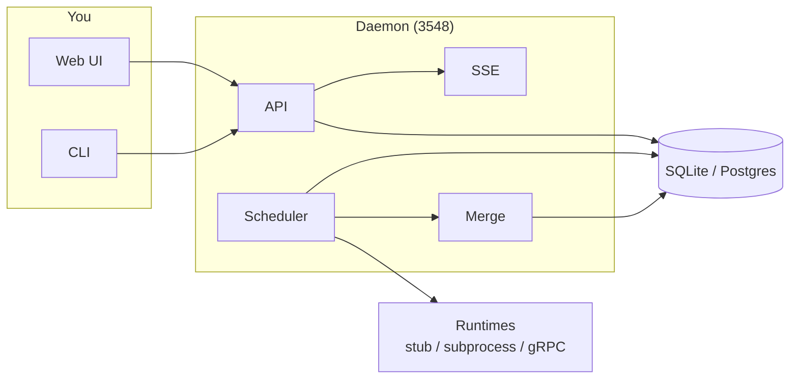

<div align="center">

[](https://github.com/ankittk/agentary/actions/workflows/ci.yml)
[](https://codecov.io/gh/ankittk/agentary)
[](https://github.com/ankittk/agentary/releases)
[](https://pkg.go.dev/github.com/ankittk/agentary)
[](https://goreportcard.com/report/github.com/ankittk/agentary)
[](https://github.com/ankittk/agentary/blob/main/LICENSE)


## Agentary: Local AI team that ships

### Go 1.21+ · Linux, macOS, Windows · x86_64, ARM64 · License Apache-2.0

[**Documentation**](https://github.com/ankittk/agentary/tree/main/docs) · [**Releases**](https://github.com/ankittk/agentary/releases)

</div>

**Not a copilot. A team that ships.**

Shipping software needs more than single prompts: tasks get split up, code needs review, and context should stick across work. One-off AI helpers forget your codebase and don't fit into real git workflows. You want a team that plans, implements, reviews each other's work, and merges into your repo, without sending your code to the cloud.

Agentary is that team, running locally. A Go daemon with HTTP API, web UI, and live SSE stream. Create teams, assign tasks to agents, run workflows (todo → review → merge), and use git worktrees with agent-to-agent review. **All data stays on your machine.**

### Why Agentary?

Most AI tools are one-shot; Agentary gives you a **persistent team** (journals, charter, shared context). **Local-first:** no cloud; optional API key when exposed. **Real git worktrees:** daemon owns merge/worktree; agents never touch branch topology. **Agent-to-agent review:** full lifecycle; you approve merges in the UI. See [Architecture](#-architecture) and [Sandboxing](#-sandboxing).

> **Note:** v0.x: use an API key when the server is reachable over a network. For production: [Sandboxing](docs/content/sandboxing.md), [Deployment](docs/content/deployment.md).

## ✨ Features

| | |
|---|---|
| **👥 Persistent teams** | Create teams, add agents and repos; tasks flow through your workflow. |
| **📋 Full lifecycle** | Todo → In progress → In review → Approval → Merge → Done. Kanban UI, reviews, diff viewer. |
| **🔒 6-layer sandbox** | Write-path guard, bash deny-list, git restrictions, optional bubblewrap, MCP guards, worktree lifecycle. |
| **🧠 Agent memory** | Per-agent journals, team charter, shared dir, per-agent config. |
| **🔌 Runtimes** | Stub, subprocess (JSON-lines), or gRPC. SQLite or Postgres. |
| **📦 Single binary** | React UI embedded via `go:embed`. ~25 MiB. No Node at runtime. |

## 🏗️ Architecture

You use the **Web UI** or **CLI**; they talk to the **API** and get live updates via **SSE**. Inside the daemon, the **scheduler** picks tasks and runs agent turns via a **runtime** (stub, subprocess, or gRPC); the **merge worker** rebases and merges when you approve. Everything persists in **SQLite** or **Postgres**.



Details: [docs/content/architecture.md](docs/content/architecture.md).

## 📦 Install

**Prerequisites:** Go 1.21+ and Git. The default runtime is stub (no external LLM). To run real agents, configure a [subprocess or gRPC runtime](docs/content/configuration.md).

### Install with precompiled binary

Download the binary for your platform from [GitHub Releases](https://github.com/ankittk/agentary/releases).

### Install from source (recommended for development)

```bash
git clone https://github.com/ankittk/agentary.git
cd agentary
make build
```

Binary is at `bin/agentary`. Or install into `$GOPATH/bin`:

```bash
go install github.com/ankittk/agentary/cmd/agentary@latest
```

### Docker

```bash
docker run -p 3548:3548 -v agentary-data:/data ghcr.io/ankittk/agentary:latest
```

## 🤖 Agents and models

Agentary **orchestrates** the team (tasks, worktrees, review flow); the actual AI is provided by the **runtime** you configure.

| Runtime | Use case |
|--------|----------|
| **stub** (default) | No LLM; tasks move through the workflow but no code is generated. Good for trying the UI and flows. |
| **subprocess** | Your own binary (e.g. a script that calls OpenAI/Anthropic). Agentary streams context; the process runs the model and returns outcomes. |
| **grpc** | A gRPC server that implements the agent runtime protocol. Use this to plug in Claude, GPT, or other providers. |

**Per-agent model:** Each agent can have a `config.yaml` with `model` and `max_tokens` (e.g. `gpt-4o-mini`, `claude-3-5-sonnet`). The runtime reads this and uses the corresponding API.

**API keys:** Set in the environment (or `.env` with `--env-file .env`). What you need depends on the runtime:

| Provider | Env var | Example models |
|----------|---------|----------------|
| **OpenAI** | `OPENAI_API_KEY` | GPT-4o, gpt-4o-mini, Codex-style code models |
| **Anthropic** | `ANTHROPIC_API_KEY` | Claude 3.5 Sonnet, Claude Opus |
| **Other** | As required by your runtime | OpenRouter, local LLMs, etc. |

The manager (task breakdown) can use an LLM when `OPENAI_API_KEY` is set; agent turns use the runtime (subprocess/gRPC) and per-agent `model` config. See [Configuration](docs/content/configuration.md) and [Agent Memory](docs/content/agent-memory.md).

## ⚙️ Configuration

- **Config:** `AGENTARY_HOME` (default `~/.agentary`), `--home`, `--env-file .env`.
- **API key:** `AGENTARY_API_KEY`; then use `X-API-Key` or `?api_key=` on requests.
- **Postgres:** `--db-driver=postgres` and `--db-url` or `DATABASE_URL`.

See [docs/content/configuration.md](docs/content/configuration.md) for all flags and env vars.

## 🚀 Quick Start

**Tip:** Data is stored in `~/.agentary` (or `AGENTARY_HOME`). Use `--env-file .env` for API key and other env vars.

**1. Start the server**

```bash
agentary start --foreground
```

Or after building: `./bin/agentary start --foreground`

**2. Open the UI**

Open **http://localhost:3548**. Kanban, agents, workflows, chat, reviews, charter, and agent memory are built in.

**3. Create your first team**

```bash
agentary team add --name myteam
agentary agent add myteam alice --role engineer
agentary agent add myteam bob --role engineer
agentary repo add --team myteam --name myrepo --source /path/to/repo
```

**4. Send a task**

In the web UI: select **myteam**, type a task title, click **Create**.

Or via API:

```bash
curl -X POST http://localhost:3548/teams/myteam/tasks \
  -H 'Content-Type: application/json' \
  -d '{"title": "Add /health endpoint"}'
```

**5. What happens next**

The scheduler assigns the task to an agent. The agent works in a git worktree, writes code, and submits for review. A reviewer agent (or you) approves or requests changes. You approve the merge in the UI; the merge worker rebases, runs tests, and merges.

That's it. You have a local AI team in a few minutes.

## 🛠️ Ways to run

| Command | When to use |
|---------|--------------|
| `make run` | Run with embedded UI. Open http://localhost:3548. No Node needed. |
| `make run-dev` | Go API (3548) + Vite (5173). Open http://localhost:5173 for frontend hot reload. Requires Node. |
| `make build` then `./bin/agentary start --foreground` | Full build with embedded React UI. |

Optional: set `AGENTARY_HOME` or `--home`; use `--env-file .env` for env vars (see [.env.example](.env.example)).

**API key (optional)**  
By default no key is required (fine for localhost). Set a key when the server is reachable over a network (LAN, tunnel, or internet) so only clients that know the secret can create teams, tasks, or change data.

1. **Generate a secret:** `agentary apikey generate` (or `openssl rand -hex 32`). Use `agentary apikey generate --env .env` to append the key to `.env`.
2. **Set on server:** `export AGENTARY_API_KEY=<your-secret>` or in `.env` with `--env-file .env`
3. **Send from clients:** header `X-API-Key: <your-secret>` or query `?api_key=<your-secret>`.  
   `/health` and `/metrics` stay unauthenticated.

## 📖 Documentation

| Topic | Description |
|-------|-------------|
| [Getting Started](docs/content/getting-started.md) | Install, first team, first task |
| [Architecture](docs/content/architecture.md) | Components, data flow, mermaid diagrams |
| [API reference](docs/content/api-reference.md) | HTTP endpoints |
| [CLI reference](docs/content/cli-reference.md) | Commands and flags |
| [Sandboxing](docs/content/sandboxing.md) | 6-layer defense, network allowlist |
| [Agent Memory](docs/content/agent-memory.md) | Journals, charter, config |
| [Configuration](docs/content/configuration.md) | Flags, env vars |
| [Workflows](docs/content/workflows.md) | Stages and transitions |
| [Data directory](docs/content/data-directory.md) | Home layout |
| [Deployment](docs/content/deployment.md) | Binary, Docker |

Serve docs locally (requires [Hugo](https://gohugo.io/)): `hugo server -s docs`.

## 🔒 Sandboxing

Agentary uses a **6-layer defense** when running agent subprocesses:

| Layer | What it does |
|-------|----------------|
| Write-path | Manager vs engineer: only allowed paths are writable |
| Bash deny-list | Blocks dangerous shell commands (`rm -rf .git`, `curl \| sh`, etc.) |
| Git deny-list | Only safe git in worktree (add, commit, diff); rebase/merge in daemon |
| OS sandbox | Optional bubblewrap: only team dir writable, `protected/` read-only |
| MCP tool guards | Task/mailbox via toolkit with fixed agent identity |
| Worktree lifecycle | Worktree add/remove and merge only in daemon |

Network egress: allowlist via `GET/POST /network`. [docs/content/sandboxing.md](docs/content/sandboxing.md).

## 📊 Benchmarks

Store layer (SQLite). Run: `go test ./internal/store/... -bench=. -benchmem -run='^$'`

| Operation | ns/op | B/op | allocs/op |
|-----------|-------|------|-----------|
| Create task + list tasks | ~290k | ~117k | ~2.4k |
| Get task by ID | ~10k | ~2.5k | ~76 |
| List tasks (50 tasks) | ~111k | ~59k | ~1.2k |
| Next runnable task | ~26k | ~2.5k | ~76 |

*Sample linux/amd64; results vary.*

## 📋 CLI Reference

| Command | Description |
|---------|-------------|
| `agentary start --foreground` | Start server (embedded UI). |
| `agentary team add --name NAME` | Create a team. |
| `agentary team list` | List teams. |
| `agentary team remove --name NAME` | Remove a team. |
| `agentary agent add TEAM NAME [--role engineer\|manager]` | Add an agent. |
| `agentary repo add --team TEAM --name NAME --source PATH` | Add a repo. |
| `agentary repo list --team TEAM` | List repos. |
| `agentary task requeue --team TEAM --id ID` | Requeue a task. |
| `agentary task assign --team TEAM --id ID --assignee WHO` | Assign a task. |
| `agentary task status` | Show task status. |
| `agentary network allow --domain DOMAIN` | Allow a domain. |
| `agentary network disallow --domain DOMAIN` | Disallow a domain. |
| `agentary workflow show --team TEAM` | Show workflow. |
| `agentary apikey generate [--env .env]` | Generate API key; optionally append to file. |
| `agentary identity detect [--repo PATH]` | Detect git user and save to members. |
| `agentary status` | Show if daemon is running. |
| `agentary doctor` | Health checks. |
| `agentary nuke` | Remove home directory and all data (destructive). |

Tasks are also created via API or web UI. Full list: [docs/content/cli-reference.md](docs/content/cli-reference.md).

## 📤 Release

| Action | Command |
|--------|---------|
| Build | `make build` or `make release` (version from git). Override: `VERSION=v1.0.0 make build`. |
| Docker image | `make docker-build`. Run: `docker run -p 3548:3548 -v agentary-data:/data ghcr.io/ankittk/agentary:latest` |

[docs/content/deployment.md](docs/content/deployment.md).

## 🐛 Troubleshooting

- **Port 3548 already in use:** Stop the other process or use `agentary start --foreground --port 3549` (and open the new port in the browser).
- **Database locked:** Only one daemon should use a given `AGENTARY_HOME`; run `agentary stop` before starting again, or use a different `--home`.
- **More help:** [Configuration](docs/content/configuration.md), [Sandboxing](docs/content/sandboxing.md), or open an [issue](https://github.com/ankittk/agentary/issues).

## 🤝 Contribute

PRs welcome. See [CONTRIBUTING.md](CONTRIBUTING.md) for development setup, tests (`go test ./...`), and commit format (Conventional Commits).

## About

Agentary is open-source (Apache-2.0). If you find it useful, star the repo or say hi in an [issue](https://github.com/ankittk/agentary/issues). Bug reports and contributions are welcome.

## 📄 License

Apache-2.0. See [LICENSE](LICENSE).
