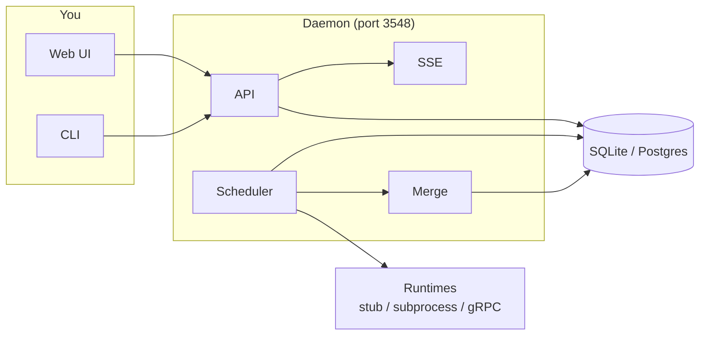

This page describes the main components of Agentary and how they interact.

## High-level overview

## Components

| Component | Description |
|-----------|-------------|
| **HTTP API** | REST-style endpoints for teams, tasks, agents, workflows, messages, network allowlist. Serves the React SPA (embedded in binary). |
| **SSE Hub** | Server-Sent Events for real-time updates (task updates, team updates, connected event). |
| **Scheduler** | Daemon loop that lists teams, picks the next runnable task per team, assigns an agent, runs a workflow turn via the configured runtime (stub, subprocess, or gRPC), and publishes events. |
| **Merge worker** | Processes tasks in the merging stage: rebases the task branch onto main, runs pre-merge checks, fast-forwards the merge, and cleans up the worktree. Runs in a goroutine alongside the scheduler. |
| **Store** | Persistence layer (SQLite by default, optional PostgreSQL). Teams, agents, tasks, workflows, messages, network allowlist. |
| **Runtimes** | **Stub** - in-process, no external calls. **Subprocess** - runs an agent binary (e.g. in bubblewrap). **gRPC** - calls an external agent service. |

## Request flow (task creation to turn)

1. User or API creates a task (e.g. `POST /teams/{team}/tasks`).
2. Store persists the task; scheduler periodically lists runnable tasks.
3. Scheduler picks a task, assigns an agent (from workflow candidate pool or default), claims the task in the store.
4. Workflow engine runs one turn: for an **agent** stage it calls the runtime (stub/subprocess/gRPC); the runtime may emit events (turn_started, agent_activity, turn_ended) which are published via the SSE hub.
5. Store is updated (task status/stage); SSE broadcasts `task_update` so the UI refreshes.
6. When a task reaches the **merging** stage (after you approve), the merge worker rebases the task branch onto main, runs pre-merge checks, fast-forwards the merge, and updates the store to done.

## Data flow

- **Home directory** (`~/.agentary` or `AGENTARY_HOME`): teams, agents, journals, charter, protected DB and allowlist.
- **Protected** area is not writable by agent processes when using the sandbox (bubblewrap).
