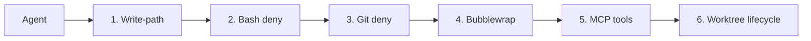

This page describes how Agentary constrains agent execution with a **6-layer defense-in-depth** model, and what you should do when running custom agent binaries.

## Six layers overview

| Layer | What it does |
|-------|----------------|
| 1. Write-path isolation | Programmatic guard limits which paths an agent can write to by role (manager vs engineer). |
| 2. Bash deny-list | Dangerous shell commands (e.g. `sqlite3`, `rm -rf .git`, `curl \| sh`) are blocked before execution. |
| 3. Disallowed git commands | Git commands that change branch topology (rebase, merge, push, etc.) are blocked; only safe ops in worktree allowed. |
| 4. OS sandbox (bubblewrap) | When enabled, the agent process runs in bubblewrap with only the team directory writable; `protected/` is read-only. |
| 5. MCP tool guards | Task and mailbox operations go through a validated toolkit that bakes in agent identity (no impersonation). |
| 6. Daemon-managed worktree lifecycle | Worktree add/remove, branch creation, rebase, and merge are done only by the daemon (merge worker). |

---

## Layer 1: Write-path isolation

- **Implementation:** `internal/sandbox/guard.go` – `WriteGuard` with `AllowWrite(path) bool`.
- **Roles:**  
  - **Manager:** may write anywhere under the team directory (`~/.agentary/teams/<team>/`).  
  - **Engineer:** may write only to: own agent dir (`teams/<team>/agents/<name>/`), task worktree dirs, and team `shared/`.
- **Usage:** Before executing any tool call that writes to the filesystem, check `guard.AllowWrite(absolutePath)`. Reject the call if it returns false.

---

## Layer 2: Bash deny-list

- **Implementation:** `internal/sandbox/deny.go` – `BlockedShellCommand(cmdLine string) bool`.
- **Blocked patterns include:** `sqlite3`, `DROP TABLE`, `DELETE FROM`, `rm -rf .git`, `chmod 777`, `curl | sh`, `wget | sh`, `eval $(`, `> /dev/sd`, `mkfs.`, and similar dangerous or destructive commands.
- **Usage:** Before running a shell command (or script snippet) from agent output, call `BlockedShellCommand(cmdLine)`. If true, do not execute.

---

## Layer 3: Disallowed git commands

- **Implementation:** `internal/sandbox/deny.go` – `BlockedGitCommand(args []string) bool`.
- **Blocked git operations:** `git rebase`, `git merge`, `git pull`, `git push`, `git fetch`, `git checkout`, `git switch`, `git reset --hard`, `git worktree`, `git branch`, `git remote`, `git filter-branch`, `git reflog expire`, etc.
- **Allowed in worktree:** Agents may run `git add`, `git commit`, `git diff`, `git status`, `git log` and other read-only or local-commit-only operations inside their assigned worktree.
- **Usage:** Before running `git` with the given args, call `BlockedGitCommand(args)`. If true, do not execute.

---

## Layer 4: OS-level sandbox (bubblewrap)

- **Implementation:** `internal/sandbox/sandbox.go` – `WrapCommand(ctx, home, teamDir, binary, args)`.
- **When `--sandbox-home` is set:** The daemon runs the agent subprocess inside **bubblewrap** (Linux only; `bwrap` must be installed).
- **When `teamDir` is set:** Only the team directory (e.g. `~/.agentary/teams/<team>/`) is writable. The rest of home (including `protected/`) is bound **read-only**, so the agent cannot modify the database or network allowlist.
- **When `teamDir` is empty:** The entire home is writable (legacy behavior).
- **Recommendation:** Use `--sandbox-home` and let the scheduler set the team dir so agents only have write access to their team directory.

---

## Layer 5: MCP tool guards

- **Implementation:** `internal/mcp/toolkit.go` – `MCPToolkit` with `CreateTask`, `SendMessage`, `ListTasks`, `ListMessages`.
- **Purpose:** Agents interact with tasks and mailbox through this toolkit. Agent identity (`AgentName`, `TeamName`) is fixed in the toolkit instance, so agents cannot impersonate others when creating tasks or sending messages.
- **Usage:** When exposing tool-call interfaces (e.g. MCP) to agents, use `MCPToolkit` for task and message operations instead of raw store access.

---

## Layer 6: Daemon-managed worktree lifecycle

- **Rule:** Git operations that **change branch topology** or **create/remove worktrees** run **only in the daemon process**, not inside the agent.
- **Daemon-only operations:**  
  - `git worktree add` / `git worktree remove`  
  - Branch creation, rebase, merge (via the merge worker)  
  - Any git command that touches remotes or reflog expiry  
- **Agent-allowed operations (inside their worktree):**  
  - `git add`, `git commit`, `git diff`, `git status`, `git log`, and similar local, non-topology-changing commands.
- **Enforcement:** Layer 3's `BlockedGitCommand` blocks the disallowed commands. The agent binary or a git wrapper should call it before invoking git. The daemon never passes topology-changing git to the agent; it performs those steps itself (e.g. in the merge worker).

---

## Network allowlist

- **Storage:** The daemon stores a global **network allowlist** (see `/network` API and `agentary network` CLI). Default is `*` (unrestricted).
- **Runtime:** For the subprocess runtime, the allowlist is set as `AGENTARY_NETWORK_ALLOWLIST` (comma-separated domains or `*`).
- **Agent responsibility:** The agent binary should restrict outbound HTTP/HTTPS to hosts matching the allowlist.

---

## Summary table

| Layer | What Agentary does | What you should do |
|-------|--------------------|--------------------|
| Write-path | `WriteGuard.AllowWrite(path)` by role | Call before any write tool |
| Bash deny-list | `BlockedShellCommand(cmdLine)` | Call before running shell commands from agent |
| Git deny-list | `BlockedGitCommand(args)` | Call before running git; agent only add/commit/diff/status/log |
| OS sandbox | `--sandbox-home` + team dir → only team dir writable; `protected/` ro | Install `bwrap` on Linux; use `--sandbox-home` |
| MCP tools | `MCPToolkit` with fixed agent identity | Use toolkit for task/message tools |
| Worktree lifecycle | Daemon does worktree add/remove and merge; agents only work inside assigned worktree | Do not expose topology-changing git to agents |
| Network | Passes allowlist via `AGENTARY_NETWORK_ALLOWLIST` | Agent binary restricts egress to those domains or `*` |
